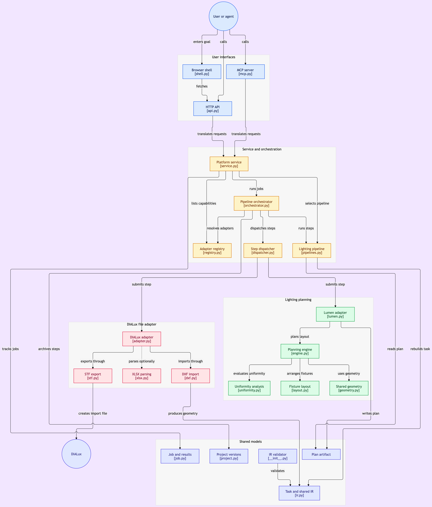

# 光枢 / OptiFlow

**光学软件统一平台**：说一个目标，平台调用对应光学软件完成任务，给出结果或方案。

- 接入对象：DIALux（照明）、Zemax（成像/仿真）、Creo（CAD）
- 平台角色：工具集（对外暴露能力），编排交给 AI agent；平台另置统一入口
- 计划文档：`D:\homework\plans\20260910_光学软件统一平台骨架_计划.md`

## 架构一句话

```
目标 → 编排层（IR 是交接点）→ 能力声明层 → 适配器层 → 软件
```

适配器统一契约五方法：`capabilities / submit / status / result / cancel`。



## 快速开始

实测环境：`D:\dev\anaconda3\python.exe`（Python 3.11.15 + pydantic 2.12）。本机 `python3` 指向 3.14，无依赖，勿用。

```powershell
# 依赖（pydantic / ezdxf / jsonschema / pytest）
D:\dev\anaconda3\python.exe -m pip install -r requirements.txt

# P0 验收一：全部测试
D:\dev\anaconda3\python.exe -m pytest tests/ -v

# 端到端演示（P0 假适配器 + P1 DIALux 文件层）
$env:PYTHONPATH = "src"
D:\dev\anaconda3\python.exe -m optiflow.demo

# 金标准核对：迁移等价性（A）+ 与历史黄金文件的同语义比对（B2）
D:\dev\anaconda3\python.exe scripts/verify_stf_parity.py
D:\dev\anaconda3\python.exe scripts/verify_stf_parity.py --break-x   # 反向验证，应红

# 冻结基准核对 / 刻意重冻结（详见 tests/fixtures/README.md）
D:\dev\anaconda3\python.exe scripts/freeze_stf_baseline.py
D:\dev\anaconda3\python.exe scripts/freeze_stf_baseline.py --write    # 只在刻意改 STF 格式时用
```

## 目录

```
src/optiflow/
  ir.py          共享语义 IR（三家软件的交接点，不含任何软件名）
  job.py         异步任务模型 JobStatus / Progress / ResultSet
  project.py     项目模型（输入 + 产物 + 结果 + 版本）
  adapter.py     适配器契约 Adapter Protocol + CapabilityDecl
  registry.py    适配器注册表
  dispatcher.py  最小编排：按 kind 选适配器 → 提交 → 等待（不做消歧，见 orchestrator）
  orchestrator.py 编排层：任务分解 → 选能力（有歧义就报错）→ 拼流水线 → 校验结果
  pipelines.py   具体流水线：照明方案 = 算法层出方案 → 文件层落 STF
  service.py     服务门面：HTTP 与 MCP 共用的同一套入口（语义只在这一层）
  api.py         HTTP 接口（stdlib http.server，零新增依赖）
  mcp.py         MCP server（stdio + tools 子集）
  geometry.py    共享几何原语（射线法 / 鞋带面积）—— 算法层与适配器共用
  shell.py       极简壳的页面加载器
  web/index.html 单页「说目标 → 出结果」（自包含，不引 CDN）
  workbench/     通用自动化工作台（Task / Trigger / Flow / Dispatcher / Config）
  algo/          算法层（P2）：先算后验的「算」那一半，纯 Python，无需任何软件在场
    lumen.py       光通量法：房间指数 / 利用系数 / 灯具数量 / 平均照度
    layout.py      布灯排布：居中网格 + 距高比约束 + 边缘间距因子
    uniformity.py  逐点法：均匀度 U0 / U1（光通量法算不出来的那个指标）
    engine.py      串起来：TaskSpec → 方案 + 合规判定 + 诚实性说明
  adapters/
    fake.py             假适配器（P0 端到端用）
    lumen.py            LumenPlannerAdapter（P2，算法层接进平台契约）
    dialux/             DIALux 文件层适配器（P1）
      dxf.py             DXF → IR（ezdxf）
      _chain.py          房间环几何后处理
      xlsx.py            XLSX 解析（可选，pandas/openpyxl）
      stf.py             IR → DIALux STF
      adapter.py         DialuxAdapter（capabilities / submit / status / result / cancel）
  demo.py        命令行演示入口（P0 假适配器 + P1 文件层 + P2 先算后验三段）
src/            被搬测试的 import 闭包（core / planner / validator / executor / tasks）
                保持 dialux-compiler 原包路径，原因见 BLOCKED.md B-2
spec/            ir.schema.json（validator 的宪法文件）
tests/           平台测试 + 从 dialux-compiler 搬来的测试
scripts/         一次性搬运脚本 + 金标准核对脚本
```

## 算法层（P2）

**先算后验**：算法层毫秒级出方案，DIALux 只做校核。

```python
from optiflow.algo import plan_layout
plan = plan_layout(task)      # 纯计算，不需要 DIALux 在场
plan.compliant                # 平均照度与均匀度是否都达标
plan.metric("uniformity_u0")  # 均匀度（逐点法，仅直射，保守下界）
plan.warnings                 # 模型边界与调整代价，必须给用户看
```

两个实测出来的建模结论，写在代码注释里防止被「优化」掉：

- **房间角落暗是因为边缘灯离墙太远，不是灯不够多**。31 盏灯时把边缘间距因子从 0.50 收到 0.25，
  U0 从 0.52 升到 0.69；而把灯数从 31 加到 100 只能到 0.52。
- **逐点法不含墙面二次反射**，所以算出的 U0 是**保守下界**（二次反射先照亮最暗的角落）。
  拿它当设计门槛偏严，不会偏松。

## 编排层

```python
from optiflow.orchestrator import Orchestrator
from optiflow.pipelines import lighting_plan_pipeline

run = Orchestrator(registry, project=project).run(lighting_plan_pipeline(), task)
run.ok            # 每步都跑完 + 所有校验通过
run.steps         # 每步用了哪个适配器、job_id、结果
run.checks        # 逐条校验结论（含跨步骤对账）
```

四个职责，对应架构图那一层：

1. **任务分解**：`Step.build` 从上下文构造本步的 TaskSpec；
2. **选能力**：`kind + tags` 选中**唯一**适配器，**有歧义就 `AmbiguousAdapter` 报错**——
   猜错的代价是一条跑到一半才发现走错通道的流水线；
3. **拼流水线**：两段之间靠**产物文件**衔接（`export` 读 `plan` 写出的 plan.json
   重建 Fixture 列表），不是内存对象——文件可以被人打开核对；
4. **校验结果**：带 `target` 的 Metric 逐条对账，跨步骤指标也一致对账
   （「算出来 31 盏、导出去 28 盏」这种掉队只有对账才发现）。

## 对外接口（HTTP + MCP）

**暴露什么**（契约）与**怎么暴露**（传输）是两件事。所有语义都在 `service.py`，
`api.py` / `mcp.py` 只做协议翻译——否则同一个目标用 HTTP 问和用 MCP 问会给出不同答案，
而 AI agent 两条路都会走。

### HTTP

```bash
D:\dev\anaconda3\python.exe -m optiflow.api --port 8765
```

| 方法 | 路径 | 说明 |
|---|---|---|
| GET | `/health` | 存活 |
| GET | `/capabilities` | 各适配器的能力声明（含 `limits`） |
| GET | `/pipelines` | 可用流水线及每步走哪条通道 |
| POST | `/run` | 同步跑一条流水线 → 结果 + 校验结论 |
| POST | `/jobs` | 异步提交 → `job_id` |
| GET | `/jobs/{id}` | 进度 |
| GET | `/jobs/{id}/result` | 结果 |
| POST | `/jobs/{id}/cancel` | 请求取消 |

**安全边界**：默认只绑回环地址，host 不是回环地址时必须显式 `--allow-remote`，
否则当场报错。**这个接口没有鉴权**——它是给本机 AI agent 用的工具接口，不是公网服务。

### MCP

```json
{
  "mcpServers": {
    "optiflow": {
      "command": "D:\\dev\\anaconda3\\python.exe",
      "args": ["-m", "optiflow.mcp"],
      "cwd": "D:\\dev\\OptiFlow",
      "env": {"PYTHONPATH": "src"}
    }
  }
}
```

工具：`optiflow_capabilities` / `optiflow_pipelines` / `optiflow_plan_lighting` /
`optiflow_submit` / `optiflow_job_status` / `optiflow_job_result` / `optiflow_job_cancel`。

自检：`python -m optiflow.mcp --self-check`

> **实现范围说清楚**：实现了 MCP 的 stdio 传输与 `initialize` / `ping` /
> `tools/list` / `tools/call`。这是 tools 子集，**不等于覆盖全部规范**
> （没有 resources / prompts / sampling / roots，也没有 stdio 之外的传输）。

## 极简壳（P5）

```bash
D:\dev\anaconda3\python.exe -m optiflow.api --port 8765
# 浏览器打开 http://127.0.0.1:8765/
```

根路径 `/` 直接吐单页界面（给人看），机器要的端点清单在 `/endpoints`。

页面自己就是用户：填房间尺寸与目标照度 → 出方案 → 看逐条校验 → 下载 DIALux 能导入的 STF。
界面里**同时显示「这份方案的适用边界」**——只给漂亮数字不给边界的界面，
比没有界面更危险，用户会拿它当结论用。

无构建步骤、无前端框架、不引 CDN（离线也能开）。命令行走一遍同样的链路：

```bash
D:\dev\anaconda3\python.exe scripts/shell_journey.py
```

## 两条 IR 纪律

1. `TaskSpec.extra` 是逃生舱：适配器私有参数一律走它，不为某个软件往 IR 加字段。
2. IR 里不出现软件名（`dialux` / `zemax` / `creo`）；出现即为设计错误。`tests/test_ir.py` 有守卫测试。

## 判卷标准

STF 的判卷标准是**迁移等价性**，参照物在本仓冻结：

- 基准：`tests/fixtures/mvp3_lums_baseline.stf`（源仓导出器输出逐字节固化）
- 守护：`tests/test_stf_golden_baseline.py`（逐字节比对 + 两条反向验证）
- 来历与换基准流程：`tests/fixtures/README.md`

> 任务书原本指定的「黄金文件」`build/mvp3_lums.stf` 是 MVP3 之前的过期产物（旧灯具格式），
> 源仓自己也生不出它，已降级为历史档。详见 `BLOCKED.md` B-1。

## 已知边界

1. **干净 clone 会少跑 2 条测试**：`test_exporter_stf.py` 有两条 `skipif` 依赖 `build/` 产物
   （`room_layout.json` / `test_room_1.stf`），而 `build/` 在 `.gitignore` 里。是 skip，不是失败。
   实测：干净 clone `177 passed, 2 skipped`（本机全量 179）。
2. **`.gitattributes` 强制 `*.stf` 保持 LF**：本机 `core.autocrlf=true`，CRLF 会让按字节比对的
   判卷基准在干净 clone 里假红（实测 2506B vs 2384B），已加防护并复测通过。
3. **双 pythonpath 将长期保留**：`pyproject.toml` 同时挂 `"src"` 与 `"."`。被搬测试的
   import 闭包（executor/uia 等）被「不可改的断言」钉死在 `src/` 顶层，无法收敛
   （见 `BLOCKED.md` B-2）；主链路自身的自包含不受影响（有守卫测试）。
4. **`requirements.txt` 必须纯 ASCII**：pip 按系统 locale（本机 GBK）解码它，中文注释会导致安装中断。
5. **取消的粒度是「步」**：流水线能在步与步之间停下，停不下正在跑的那一步
   （那要各适配器自己实现 `cancel`）。API 与工具的描述里写的都是这个粒度。
6. **HTTP 接口没有鉴权**，只绑回环。别把它暴露到公网。
7. **壳已有真浏览器端到端**（2026-09-25）：`tests/test_shell_browser.py` 用 Playwright 在
   真浏览器跑完整旅程（表单 → 出方案 → 校验全绿 → 下载 STF）；缺 playwright/浏览器时 skip。
   静态校验（`node --check`、标签配对、fetch 路由对照）与 `scripts/shell_journey.py`
   仍在，作为无浏览器环境的替代证据。
8. **`--validate` 已自包含**（2026-09-25）：validator 已迁入 `optiflow/validator`，schema 随包
   （`src/optiflow/spec/`）。`grep "from src\." src/optiflow/` 为空——主链路与校验路径均不依赖
   搬运件闭包（有守卫测试，见 `BLOCKED.md` B-10）。
9. **`Dispatcher` 本身不做消歧**：它只按 `kind` 取注册表里**第一个**声明它的适配器。
   `LumenPlannerAdapter` 与 `DialuxAdapter` 都声明 `kind="layout"`（处理同一类任务、深度不同），
   所以直接用它会有「换一下注册顺序就换个通道」的坑（实测踩过）。
   **要跑多步流水线请走 `Orchestrator`**：它按 `kind + tags` 选唯一的适配器，选不唯一就报错。

## 阶段状态

| 阶段 | 状态 |
|---|---|
| P0 骨架（IR + 契约 + 假适配器端到端） | ✅ 完成（11 条测试） |
| P1 DIALux 适配器 | 🔶 **文件层完成**（DXF 解析 + STF 导出 + DialuxAdapter，179 条测试全绿）；真机 UI 与落灯未接 |
| P2 算法层（光通量法） | ✅ 完成（利用系数法布灯 + 逐点法均匀度 + 求解器） |
| 编排层 | ✅ 完成（任务分解 / 选能力 / 拼流水线 / 校验结果，260 条测试全绿） |
| 对外接口（HTTP + MCP） | ✅ 完成（服务门面 + HTTP 接口 + MCP server） |
| P5 极简壳 → APP | ✅ 完成（单页「说目标 → 出结果」） |
| P1② DIALux 真机 UI 与落灯 | ⏸ 待用户授权（会真实启动并操作 DIALux） |
| P3 Creo 适配器 | ⛔ 需装机（本机未装 Creo/PTC） |
| P4 Zemax 适配器（ZPL 降级路） | ⛔ 需装机（本机未装 Zemax） |
